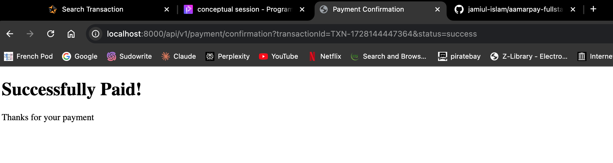

# Exploring aamarPay

This project is a full-stack web application consisting of a client and a server. The client is built with React and uses Vite for development and build processes. The server is built with Node.js and TypeScript.

## Client

The client-side code is located in the `client` directory.

## Server

The server-side code is located in the `server` directory.

## Screenshots of APP

- **Homepage**

- **Shopping Cart**

- **Address Page**

- **Payment Status: Pending**

- **Payment Getaway Page**

- **OTP Confirmation Page**

- **Payment Confirmation Page**

- **Payment Status: Confirmed**

- **Order Successful in Frontend**

